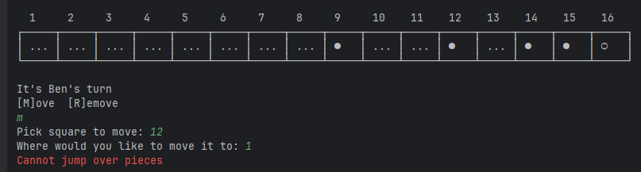
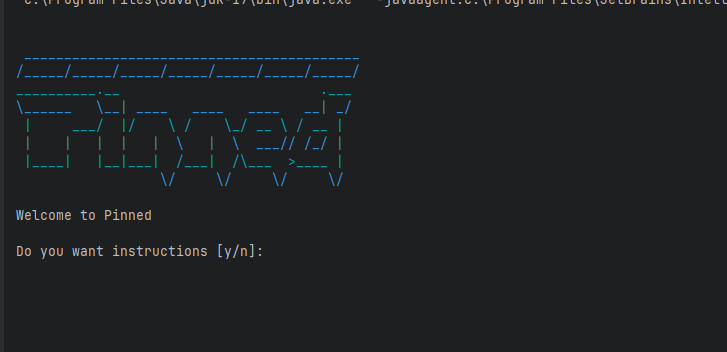

# Results of Testing

The test results show the actual outcome of the testing, following the [Test Plan](test-plan.md)

---

## Example Test Name

If the player tried to jump over other pieces the game should reject what the player is doing and give the player an error

### Test Data Used

I will try to move a piece that would jump over a different piece

### Test Result

The test was invalid as the game rejected the players move as you can't jump over other pieces 

---

## Example Test Name

Test if player's can put in their names. The game needs the players names so the game can say who's turn it is and also say who won the game.

### Test Data Used

Im going to put player ones name to Ben1 and player twos name Ben2.

### Test Result

Test was valid as the game let me name player 1 and 2

---

## Player Counter Selection - BOUNDARIES

I will test the boundaries of the counter input
### Test Data Used

I will attempt to select counters at position 1 and position 16, the boundaries of the board

I will do this for player 1 and player 2
### Test Result

The test passed - the counters in positions 1 and 16 were selected ok
---

## Example Test Name

Example test description. Example test description.Example test description. Example test description.Example test description. Example test description.

### Test Data Used

Details of test data. Details of test data. Details of test data. Details of test data. Details of test data. Details of test data. Details of test data.

### Test Result

Comment on test result. Comment on test result. Comment on test result. Comment on test result. Comment on test result. Comment on test result.

---

## Example Test Name

Example test description. Example test description.Example test description. Example test description.Example test description. Example test description.

### Test Data Used

Details of test data. Details of test data. Details of test data. Details of test data. Details of test data. Details of test data. Details of test data.

### Test Result

Comment on test result. Comment on test result. Comment on test result. Comment on test result. Comment on test result. Comment on test result.

---

