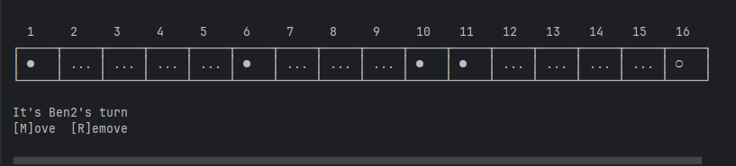
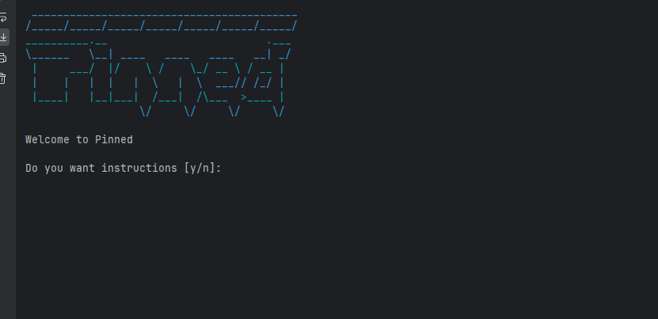
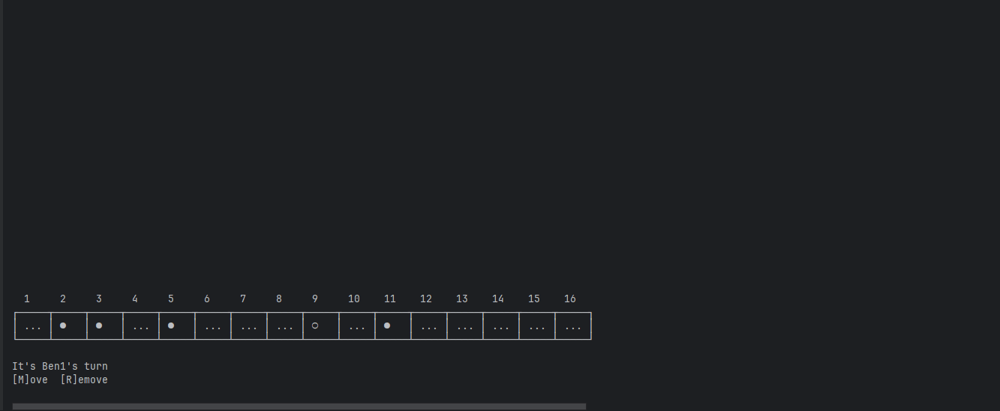
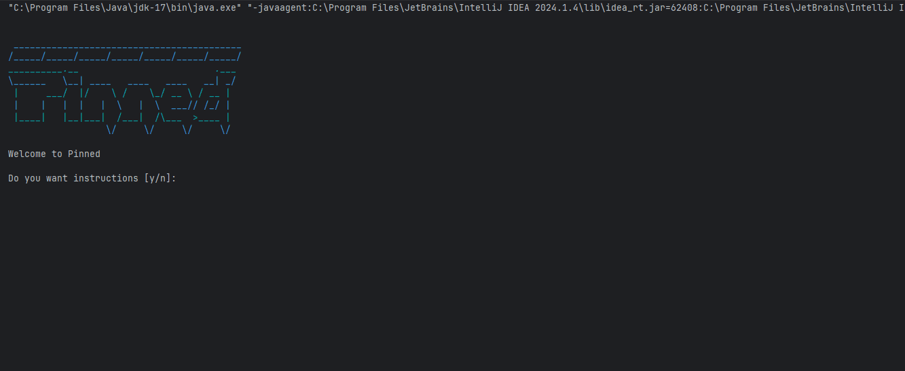

# Results of Testing

The test results show the actual outcome of the testing, following the [Test Plan](test-plan.md)

---

## Can't jump over other pieces - INVALID

If the player tried to jump over other pieces the game should reject what the player is doing and give the player an error

### Test Data Used

I will try to move a piece that would jump over a different piece

### Test Result

The test was invalid as the game rejected the players move as you can't jump over other pieces 

---

## Player's can put names in - VALID

Test if player's can put in their names. The game needs the players names so the game can say who's turn it is and also say who won the game.

### Test Data Used

Im going to put player ones name to Ben1 and player twos name Ben2.

### Test Result

Test was valid as the game let me name player 1 and 2

---

## Player Counter Selection - BOUNDARIES

I will test the boundaries of the counter input
### Test Data Used

I will attempt to select counters at position 1 and position 16, the boundaries of the board

I will do this for player 1 and player 2
### Test Result

The test passed - the counters in positions 1 and 16 were selected ok
---

## Ask for game instructions - VALID

When the player first loads up the game it should ask if they want to know how to play Pinned

### Test Data Used

Im going to load up the game and see if the game asks if I want to know how to play the game.

### Test Result

The game asked me if I wanted to know how to play the game so it was a valid test.
---

## Player can move a coin - VALID

Test to see if the player can move a coin

### Test Data Used

I moved a coin
### Test Result

It worked and let me move a coin

---

## The game was fully playable

## Game is fully playable - Gameplay

Test to see if the game can be played from start to end and show stuff like a winner

### Test Data Used

I played the game from the start to the end to see if it is playable

### Test Result

The game is fully playable
---

